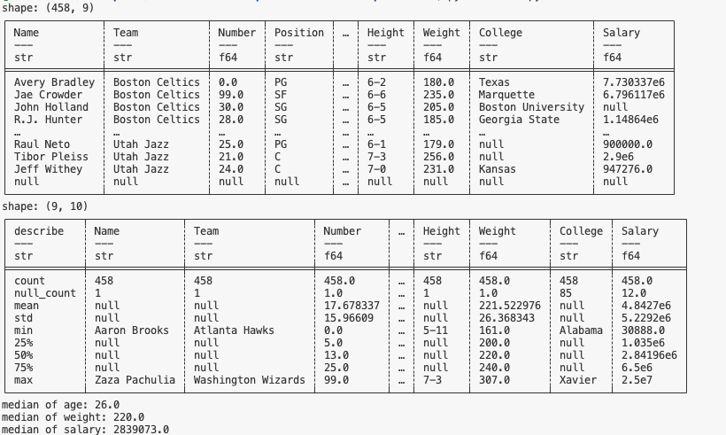
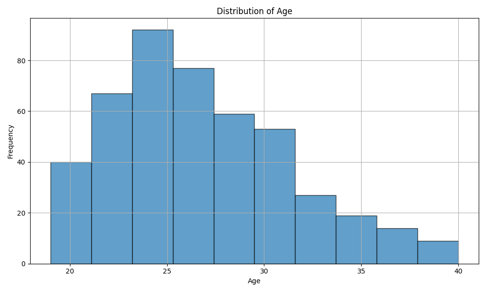
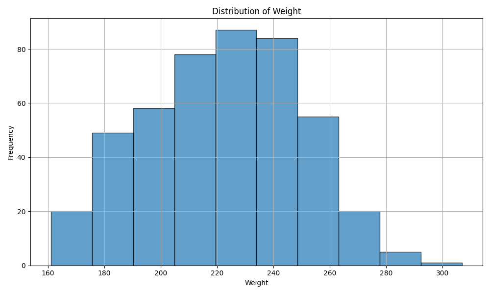
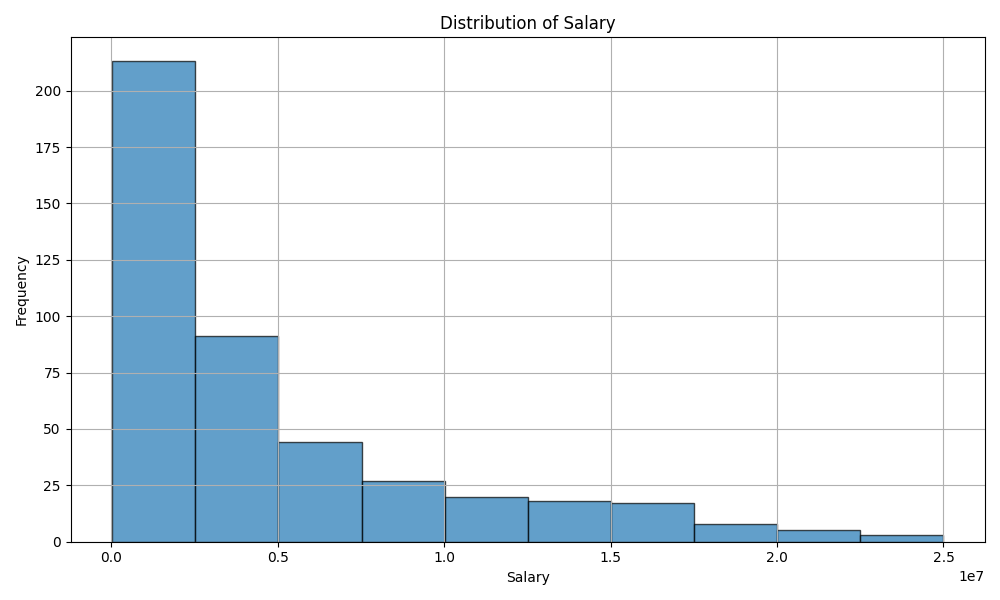

# Project1ContinuousIntegrationusingGitHubActionsofPythonDataScienceProject
## Requirements
The project structure include the following files: 
Jupyter Notebook with Cells that perform descriptive statistics using Polars. 
Tested by using nbval plugin for pytest 
Python Script performing the same descriptive statistics using Polars 
lib.py file that shares the common code between the script and notebook 
Makefile with： 
Run all tests (test notebook and script and lib) 
Formats code with Python black 
Lints code with Ruff 
Installs code via:  pip install -r requirements.txt 
test_script.py to test script 
test_lib.py to test library 
GitHub Actions performs all four Makefile commands with badges for each one in the README.md

## Video Link

## Description
This project was generated from python template, which includes Makefile, requirements.txt, githubAction etc. It can automatically install, test, format, lint my change.
In this project, I read nba.csv file using polar. This file contains many players with name, team, number, position, age, height, weight, college and salary. Then i calculate mean, min, max, standard deviation and median for this dataset. Then I print the result to terminal for data visualization. Finally, I used matplotlib to generate age distribution graph shwon in Age_distribution.png, Weight_distribution_polar.png, Salary_distribution_polar.png.

## Sample Output

